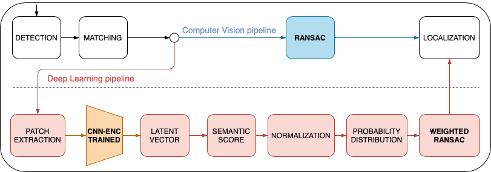

# RGB-D Semantic Sampling
Image Analysis and Computer Vision course project 2021-2022, Politecnico di Milano.

This work analyses the Localization task of RGB-D images using a Deep Neural Network (DNN) tuned to improve the baseline performance of RANSAC by exploiting visual semantic information. We propose a DNN able to extract a semantic sampling distribution from paired key points to improve the Mean Average Accuracy (mAA), chosen as a reference metric. Next, the importance of the depth channel is shown by comparing the same DNN trained on RGB or RGB-D. Finally, Point Clouds are generated from paired images of the same scene, and Registration is performed to visualize the results in 3D space through the depth information.

The proposed methodology has been conceived for the purpose of improving the RANSAC baseline by taking into account the visual paired-semantic information of two images referring to the same scene; as a result, a weighted sampling distribution is produced to build up the model.
While the standard Localization approach straightforwardly takes place by applying RANSAC right after the detection-matching computation, our technique is structured as follows

